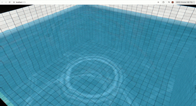

# react-three-water-caustics

Water caustics simulation for [React Three Fiber](https://docs.pmnd.rs/react-three-fiber). Provides an interactive, GPU-simulated water surface that projects realistic caustics onto arbitrary meshes, via a **Provider + Hook** pattern.



## Features

- **Provider + Hook architecture** — `WaterCausticsProvider` runs the water simulation once; any descendant reads shared uniforms via `useWaterCaustics()`.
- **World-space projected caustics** — caustics project onto any mesh using world XZ coordinates, not just a single plane.
- **Interactive ripples** — `CausticsInteractionPlane` turns pointer move/down events into ripples and drops in the simulation.
- **Ambient auto-ripples** — toggle periodic ambient ripples with `enableWaterDrop`.
- **Shared uniform references** — the provider creates `{ value }` uniform objects once; consumers spread them into their own `ShaderMaterial`/`CustomShaderMaterial` instances and the provider's per-frame mutation updates every consumer without each one needing its own `useFrame`.

## Install

```bash
npm install react-three-water-caustics
```

Peer dependencies: `react` >=18, `three` >=0.150, `@react-three/fiber` >=8.

## Quick Start

```tsx
import { Canvas } from "@react-three/fiber";
import {
  WaterCausticsProvider,
  useWaterCaustics,
  CausticsInteractionPlane,
  poolCausticsVertexShader,
  poolCausticsFragmentShader,
} from "react-three-water-caustics";

function CausticsFloor() {
  const { uniforms } = useWaterCaustics();
  return (
    <mesh rotation={[-Math.PI / 2, 0, 0]}>
      <planeGeometry args={[10, 10]} />
      <shaderMaterial
        vertexShader={poolCausticsVertexShader}
        fragmentShader={poolCausticsFragmentShader}
        uniforms={uniforms}
      />
    </mesh>
  );
}

export default function Scene() {
  return (
    <Canvas camera={{ position: [0, 3, 8] }}>
      <WaterCausticsProvider size={10} waterSurfaceY={4}>
        <CausticsFloor />
        <CausticsInteractionPlane />
      </WaterCausticsProvider>
    </Canvas>
  );
}
```

### `WaterCausticsProvider` props

| Prop | Type | Default | Description |
|---|---|---|---|
| `position` | `[number, number, number]` | `[0, 0, 0]` | World position of the water volume. |
| `size` | `number` | `10` | Width/depth of the simulated water area. |
| `enableWaterDrop` | `boolean` | `true` | Periodically spawn ambient ripples in the water simulation. |
| `chromaticAberration` | `number` | `0.005` | Chromatic aberration strength applied by the caustics shaders. |
| `waterSurfaceY` | `number` | `5` | World Y coordinate of the water surface plane. |
| `depthColor` | `string` | `'#66e5ff'` | Tint color applied with depth. |
| `depthDistance` | `number` | `5` | Distance over which `depthColor` fully applies. |
| `lightDir` | `[number, number, number]` | `[0.667, 0.667, -0.333]` | Normalized light direction used by the caustics shaders. |

### `useWaterCaustics()` return value

| Field | Type | Description |
|---|---|---|
| `uniforms` | `WaterCausticsUniforms` | Shared uniform references (auto-updated by the provider). |
| `addDrop` | `(x, y, radius?, strength?) => void` | Add a ripple at simulation coordinates (-1 to 1). |
| `enableWaterDrop` | `boolean` | Current value of the `enableWaterDrop` prop. |

### Shaders

| Shader | Description |
|---|---|
| `poolCausticsVertexShader` / `poolCausticsFragmentShader` | Caustics for a flat pool floor. |
| `projectedCausticsVertexShader` / `projectedCausticsFragmentShader` | Generic world-space projected caustics with a `baseColor` uniform. |
| `projectedTileCausticsFragmentShader` | Tile caustics with PBR textures + refraction (pair with `projectedCausticsVertexShader`). |
| `waterSurfaceVertexShader` | Vertex shader for rendering the animated water surface itself. |

## Run the Examples

```bash
git clone <repository-url>
cd react-three-water-caustics
npm install
npm run dev
```

Open the URL Vite prints (usually `http://localhost:5173`). The examples app (`examples/`) is a full demo scene — pool, projected caustics on a sphere and tile, and a water surface with pointer ripples — built entirely against the published public API.

## License

See [LICENSE](LICENSE).
